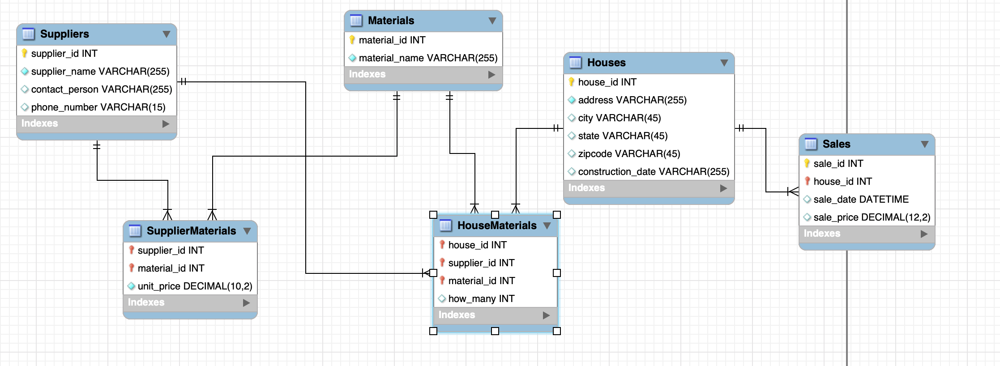

# Crescent-1

## Introduction
A Data Science tool for construction companies. Uses Multiple Linear Regression to predict profits based on suppliers, location, sq. footage, etc. The processing and analysis of the dataset is optimized by the Gradient Descent Algorithm. Built in Python.

## Data Model

## Usage
This project comes with three Python scripts - **dataGenerator.py**, **SetupSQL.py** and **ML.py**.

The **Data Generator** script creates mock data for a fictional construction company. According to parameters set in the script, you can 
- Control how many houses were constructed and sold
- Supplier prices
- Construction materials used from particular suppliers
- How many years worth of historical data needs to be created
- Supplier prices
- House construction locations

The output is a CSV file that can later be read by the SetupSQL.py script to load the dataset onto an sql database.

**SetupSQL.py** establishes a connection to the SQL database and executes the required queries to
- Setup tables along with their Primary and Foreign Keys
- Read files and load data onto the tables
- Empties the database before program is quit

**ML.py** demonstrates use of the **Multiple Linear Regression** algorithm to predict sales, and hence profit, for a particular year. The historical data that was fed into the database is used to come up with a model that will predict our sales price based on past performance. The **features** (variables that affects the prediction) are namely: Construction Prices, Locations, Square Footage and Supplier Prices. The **Gradient Descent** algorithm is used to find the final values for Bias(β) and Weight(θ) after obtaining the lowest possible value for the cost function. Those final values can then be used to predict an outcome.

## Installation
TBD
