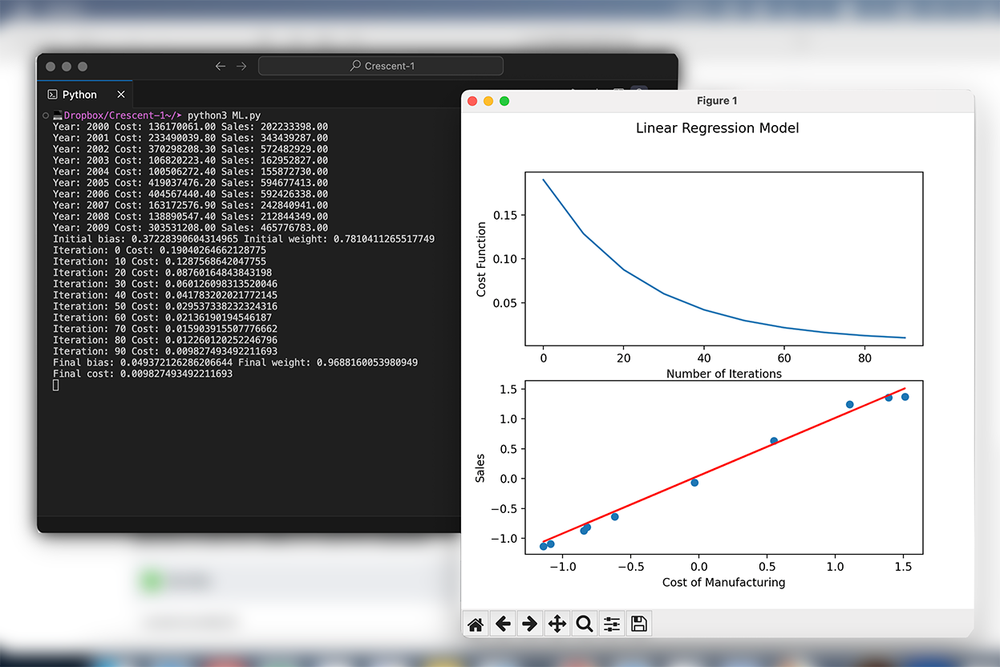

# Crescent-1: A Data Analyzer

## Introduction
This program demonstrates how Python is used to send SQL queries to a database for data analysis. It is capable of producing data trends, which are useful for studying the performance of a project. In this case, we have mock data for a building company that builds houses.

## Installation
This project requires matplotlib and sql-connector-python to be installed.
> pip3 sql-connector-python
> pip3 matplotlib
pip is usually shipped with python, so install python if you don't have it.

## Usage
This program is used for data analysis. For now, this program demonstrates its usage with mock data from a building company. This program can show data trends like how many houses were built between 2014 and 2024, or what is highest price a house was sold for, etc. This program can also predict future scenarios using machine learning algorithms that are trained on historical data. For example, we can use it to predict the profits for the following year based on current data like company performance, customer loyalty, sales rate, time of year, etc.
